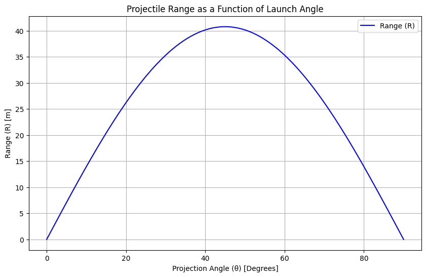

# **Investigating the Range as a Function of the Angle of Projection**

## **1. Motivation**
Projectile motion, while seemingly simple, provides a rich foundation for understanding fundamental physics principles. The problem is straightforward: analyze how the range of a projectile depends on its angle of projection. However, beneath this simplicity lies a complex framework involving both linear and quadratic relationships.

This topic is particularly compelling due to the number of free parameters involved, such as:
- **Initial velocity** $v_0$
- **Gravitational acceleration** $g$
- **Launch height** $h$


These parameters give rise to a diverse set of solutions that describe real-world phenomena, from the arc of a soccer ball to the trajectory of a rocket.

---

## **2. Theoretical Foundation**
To analyze projectile motion, we derive the governing equations from fundamental principles, primarily Newton's second law of motion.

### **2.1. Equations of Motion**
The horizontal and vertical motion of a projectile are governed by kinematic equations:

- **Horizontal motion (constant velocity):**

$$x(t) = v_0 \cos(\theta) t$$

- **Vertical motion (accelerated motion due to gravity):**

$$y(t) = v_0 \sin(\theta) t - \frac{1}{2} g t^2$$


where:

- $x(t)$ and $y(t)$ are the projectile's position at time $t$.
- $v_0$ is the initial velocity.
-  $\theta$ is the launch angle.
- $g$ is the gravitational acceleration (typically 9.81 m/s² on Earth).

### **2.2. Time of Flight**

The total time the projectile spends in the air can be determined by setting $y(t) = 0$:

$$t_f = \frac{2 v_0 \sin(\theta)}{g}$$

### **2.3. Range Equation**

The range $R$ is the total horizontal distance traveled before the projectile lands.
Using $t_f$ in the horizontal motion equation:
 $$R = v_0 \cos(\theta) \cdot \frac{2 v_0 \sin(\theta)}{g}$$

Using the trigonometric identity $$2\sin(\theta) \cos(\theta) = \sin(2\theta)$$, we obtain:
$R(\theta) = \frac{v_0^2}{g} \sin(2\theta)$

### **2.4. Maximum Range**
The maximum range occurs when $\sin(2\theta)$ is maximized, which happens at $\theta = 45^\circ$:
$R_{max} = \frac{v_0^2}{g}$

---

## **3. Analysis of the Range**

### **3.1. Dependence on Angle**
- The range follows a **symmetrical** pattern around $\theta = 45^\circ$.
- Angles $\theta$ and $90^\circ - \theta$ result in the same range.

### **3.2. Effect of Initial Velocity**
- Higher $v_0$ leads to a longer range, proportional to $v_0^2$.

### **3.3. Effect of Gravity**
- A larger $g$ (such as on Jupiter) reduces range, while a smaller $g$ (such as on the Moon) increases it.

---

## **4. Practical Applications**

- **Sports Science:** Calculating optimal angles for throwing or kicking a ball.
- **Military Ballistics:** Estimating projectile paths in artillery and missile systems.
- **Space Exploration:** Understanding launch angles for satellites and rockets.

---

## **5. Implementation: Python Simulation**
We implement a computational tool to visualize the range as a function of the angle.

### **5.1. Required Libraries**
```python
import numpy as np
import matplotlib.pyplot as plt
```

### **5.2. Simulation Code**
```python
# Define parameters
v0 = 20  # Initial velocity (m/s)
g = 9.81  # Gravity (m/s^2)
theta = np.linspace(0, 90, 100)  # Angle range from 0 to 90 degrees

# Compute range
R = (v0**2 * np.sin(np.deg2rad(2 * theta))) / g

# Plot the range vs. angle
plt.figure(figsize=(10, 6))
plt.plot(theta, R, label='Range (R)', color='blue')
plt.xlabel('Projection Angle (θ) [Degrees]')
plt.ylabel('Range (R) [m]')
plt.title('Projectile Range as a Function of Launch Angle')
plt.grid(True)
plt.legend()
plt.show()
```


## 🚀 Projectile Motion Simulation

This simulation demonstrates the **parabolic trajectory of a projectile** launched at a given angle and velocity.  
Users can **adjust the launch angle and initial speed**, allowing them to observe how different conditions affect projectile motion.

### 📌 **How It Works?**
- The user selects a **launch angle (0° - 90°) and initial velocity (5 - 50 m/s)**.
- Pressing the **"Start Simulation"** button runs the animation based on the selected values.
- A **moving particle (blue dot) follows a curved trajectory due to gravity**.
- The **graph dynamically updates** to show the horizontal and vertical motion.

### 🖥 **Use Cases**
✅ **Understanding projectile motion in physics courses.**  
✅ **Basic modeling for engineering and ballistic calculations.**  
✅ **Trajectory analysis for real-world problems.**  

🔗 **Run the Simulation on Google Colab:**  
https://colab.research.google.com/drive/1U-gdNsOIBkSQR3tMoc0KqLe4vPOr5lib?usp=sharing


### **5.3. Expected Output**
- A **parabolic curve** showing maximum range at **45°**.
- Symmetry about **45°**, showing equal ranges for complementary angles.

---

## **6. Discussion and Future Improvements**

### **6.1. Limitations of the Model**
- **No air resistance**: Real-world projectiles experience drag.
- **Constant gravity**: Gravity varies slightly with altitude.
- **No wind effects**: Wind can significantly alter trajectories.

### **6.2. More Realistic Models**
- Incorporate **air resistance** using differential equations.
- Extend the model to **uneven terrain**.
- Use **numerical methods** (Euler’s method) for more complex simulations.

---

## **7. Conclusion**
- The range equation follows a clear mathematical pattern.
- Maximum range occurs at **45°**, confirmed analytically and numerically.
- This study has applications in sports, engineering, and physics simulations.

---

## **8. References & Further Reading**
- Resnick, R., & Halliday, D. (2004). *Fundamentals of Physics*.
- MIT OpenCourseWare: Classical Mechanics Lectures.
- NASA’s trajectory analysis for spacecraft launches.

---


