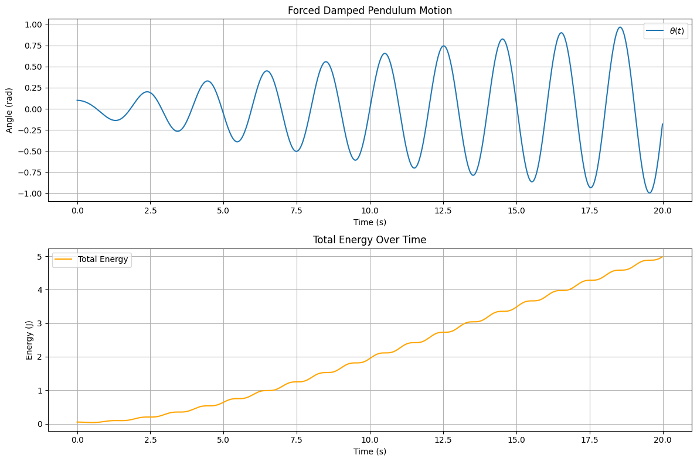
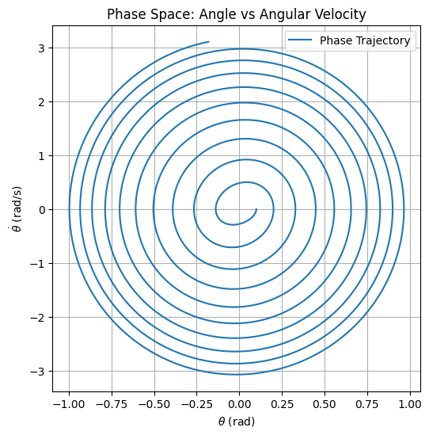
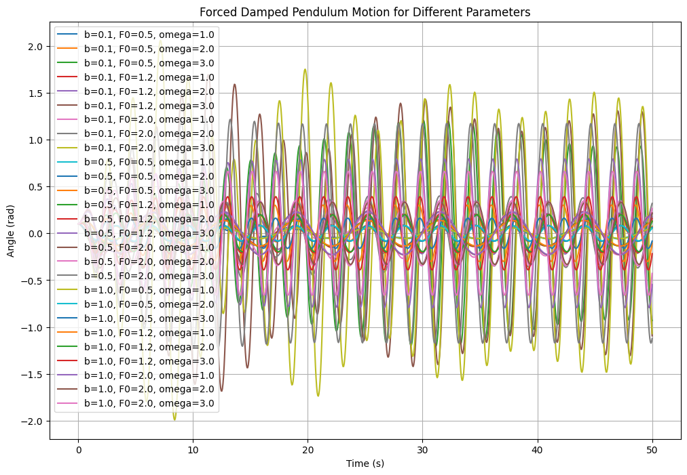
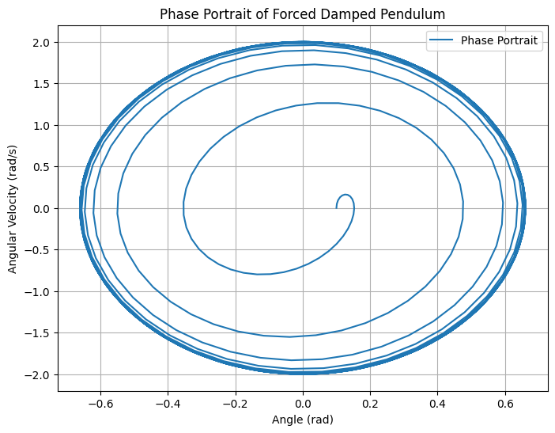
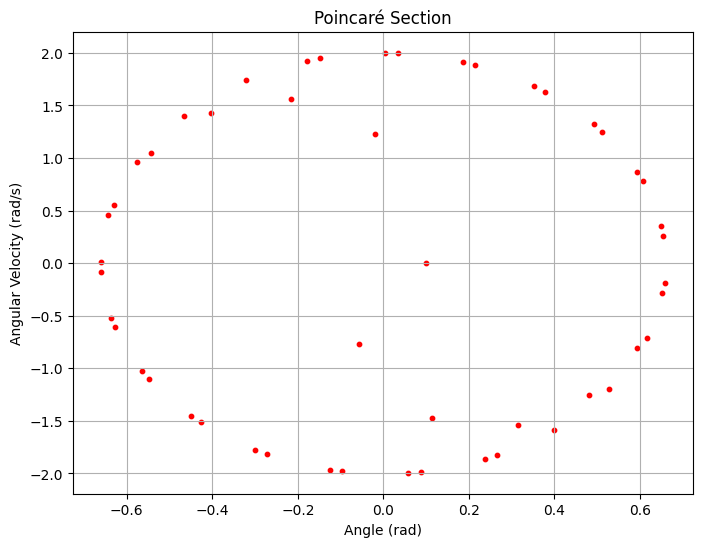
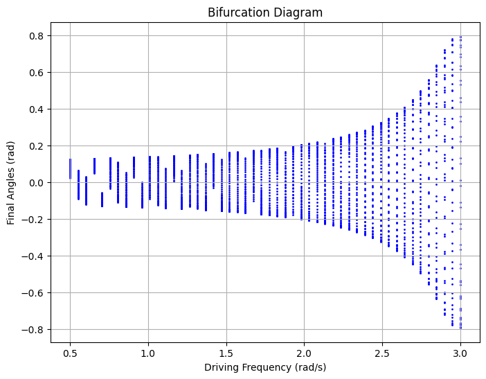

# Problem 2
# Investigating the Dynamics of a Forced Damped Pendulum

## **1. Motivation**
The forced damped pendulum is a classic example of a nonlinear system exhibiting a rich spectrum of dynamic behaviors. By introducing damping and external periodic forcing, the system transitions from simple harmonic motion to more complex phenomena, such as resonance, quasiperiodicity, and chaos. Understanding these dynamics is essential in fields ranging from mechanical engineering to climate modeling and electrical circuits.

The introduction of an external periodic force adds new parameters, including amplitude and frequency, which significantly affect the pendulum's motion. By varying these parameters, we can observe different behaviors, including synchronized oscillations, chaotic motion, and resonance effects. These dynamics not only illustrate fundamental physical principles but also provide practical insights into engineering applications such as energy harvesting, vibration isolation, and resonance mitigation.

---

## **2. Theoretical Foundation**

### **2.1 Governing Differential Equation**
The motion of a forced damped pendulum is governed by Newton’s Second Law applied to rotational motion:

$$I \alpha = \sum \tau$$

For a simple pendulum of mass $m$ and length $L$, the moment of inertia about the pivot is:


$$I = mL^2$$


The forces acting on the pendulum bob include:

- **Gravitational force**: Produces a restoring torque:

$$\tau_{\text{gravity}} = -mgL \sin \theta$$

- **Damping force**: Opposes motion due to air resistance:

$$\tau_{\text{damping}} = -b L \frac{d\theta}{dt}$$

- **External forcing**: A periodic force applied to the system:

$$\tau_{\text{forcing}} = F_0 L \cos(\omega t)$$


Applying Newton’s Second Law:

$$mL^2 \frac{d^2\theta}{dt^2} = -mgL \sin\theta - b L \frac{d\theta}{dt} + F_0 L \cos(\omega t)$$

Dividing by $mL^2$, we obtain the standard form:

$$
\frac{d^2\theta}{dt^2} + \gamma \frac{d\theta}{dt} + \omega_0^2 \sin\theta = A \cos(\omega t)
$$

where:

- **Natural frequency**: 

$$\omega_0 = \sqrt{\frac{g}{L}}$$


- **Damping coefficient**: 

$$\gamma = \frac{b}{mL}$$

- **Forcing term**: 

$$A = \frac{F_0}{mL}$$


---

### 1.2 Approximate Solutions for Small-Angle Oscillations

For small angles $\theta \ll 1$, we use the small-angle approximation:

$$\sin\theta \approx \theta$$

Substituting this into the equation simplifies it to:

$$\frac{d^2\theta}{dt^2} + b \frac{d\theta}{dt} + \frac{g}{L} \theta = A \cos(\omega t)$$

This is a linear inhomogeneous second-order differential equation that can be solved using standard techniques.

#### 1.2.1 General Solution

The general solution consists of:

1. Homogeneous solution $A = 0$, solving:

$$\frac{d^2\theta}{dt^2} + b \frac{d\theta}{dt} + \frac{g}{L} \theta = 0$$

The characteristic equation is:

$$r^2 + br + \frac{g}{L} = 0$$

Solving for $r$, the solution depends on the damping coefficient $b$:

- Underdamped case $b^2 < 4g/L$:

$$\theta_h(t) = e^{-bt/2} (C_1 \cos(\omega{\prime} t) + C_2 \sin(\omega{\prime} t))$$

where $$ omega{\prime} = \sqrt{\frac{g}{L} - \frac{b^2}{4}} $$ is the damped frequency.

- Overdamped and critically damped cases are handled similarly but result in non-oscillatory motion.

2. Particular solution for the forced term:

$$\theta_p(t) = A_0 \cos(\omega t - \delta)$$

where:

$$A_0 = \frac{A}{\sqrt{\left(\frac{g}{L} - \omega^2\right)^2 + b^2 \omega^2}}$$

and

$$\tan\delta = \frac{b\omega}{\frac{g}{L} - \omega^2}$$

Thus, the full solution is:

$$\theta(t) = e^{-bt/2} (C_1 \cos(\omega{\prime} t) + C_2 \sin(\omega{\prime} t)) + A_0 \cos(\omega t - \delta)$$

where the first term decays over time, leaving only the steady-state oscillation.

---


### 1.3 Resonance Conditions and Energy Implications

Resonance occurs when the driving frequency $\omega$ approaches the system’s natural frequency:

$$\omega \approx \sqrt{\frac{g}{L}}$$

At resonance, the amplitude $A_0$ is maximized:

$$A_{\text{max}} \approx \frac{A}{b\omega}$$

which shows that:
- For small damping $b \to 0$, the amplitude can grow excessively, leading to large oscillations.
- For strong damping, resonance is suppressed, and energy is dissipated before large oscillations develop.

The total energy of the system:

$$E = \frac{1}{2} m L^2 \dot{\theta}^2 + \frac{1}{2} mgL \theta^2$$

is maximized at resonance, which can lead to destructive consequences in mechanical systems (e.g., bridges, buildings). Damping helps dissipate this energy and stabilize the system.

---


## 2.2  Python Visualizations
```python
import numpy as np
import matplotlib.pyplot as plt

# Parameters
g = 9.81          # gravitational acceleration (m/s^2)
L = 1.0           # pendulum length (m)
b = 0.1           # damping coefficient (s^-1)
A = 0.5           # forcing amplitude
omega = np.sqrt(g / L)  # driving frequency (resonance condition, rad/s)
theta0 = 0.1      # initial angle (radians)
theta_dot0 = 0.0  # initial angular velocity (rad/s)

# Time settings
t_max = 20.0      # total simulation time (s)
dt = 0.01         # time step (s)
t = np.arange(0, t_max, dt)  # time array

# Define the system of ODEs
def pendulum_derivatives(t, state, b, g, L, A, omega):
    theta, theta_dot = state
    dtheta_dt = theta_dot
    dtheta_dot_dt = -b * theta_dot - (g / L) * theta + A * np.cos(omega * t)
    return np.array([dtheta_dt, dtheta_dot_dt])

# RK4 solver
def rk4_step(t, state, dt, b, g, L, A, omega):
    k1 = pendulum_derivatives(t, state, b, g, L, A, omega)
    k2 = pendulum_derivatives(t + dt/2, state + dt * k1/2, b, g, L, A, omega)
    k3 = pendulum_derivatives(t + dt/2, state + dt * k2/2, b, g, L, A, omega)
    k4 = pendulum_derivatives(t + dt, state + dt * k3, b, g, L, A, omega)
    return state + (dt / 6) * (k1 + 2*k2 + 2*k3 + k4)

# Initialize arrays
state = np.array([theta0, theta_dot0])  # [theta, theta_dot]
theta = np.zeros(len(t))
theta_dot = np.zeros(len(t))
theta[0], theta_dot[0] = state

# Simulate the motion
for i in range(1, len(t)):
    state = rk4_step(t[i-1], state, dt, b, g, L, A, omega)
    theta[i], theta_dot[i] = state

# Calculate total energy
m = 1.0  # mass (kg), assumed for simplicity
energy = 0.5 * m * L**2 * theta_dot**2 + 0.5 * m * g * L * theta**2

# Plotting
plt.figure(figsize=(12, 8))

# Angle vs Time
plt.subplot(2, 1, 1)
plt.plot(t, theta, label=r'$\theta(t)$')
plt.xlabel('Time (s)')
plt.ylabel('Angle (rad)')
plt.title('Forced Damped Pendulum Motion')
plt.grid(True)
plt.legend()

# Energy vs Time
plt.subplot(2, 1, 2)
plt.plot(t, energy, label='Total Energy', color='orange')
plt.xlabel('Time (s)')
plt.ylabel('Energy (J)')
plt.title('Total Energy Over Time')
plt.grid(True)
plt.legend()

plt.tight_layout()
plt.show()

# Optional: Phase space plot
plt.figure(figsize=(6, 6))
plt.plot(theta, theta_dot, label='Phase Trajectory')
plt.xlabel(r'$\theta$ (rad)')
plt.ylabel(r'$\dot{\theta}$ (rad/s)')
plt.title('Phase Space: Angle vs Angular Velocity')
plt.grid(True)
plt.legend()
plt.show()
```



## Explanation of the Code
### Parameters

The following physical constants and initial conditions are defined with realistic values:

- $g$: Gravitational acceleration (m/s²).
- $L$: Pendulum length (m).
- $b$: Damping coefficient (s⁻¹).
- $A$: Forcing amplitude.
- $\omega$: Driving frequency (rad/s), set to $\omega = \sqrt{\frac{g}{L}}$ to match the natural frequency for resonance.
- Initial conditions:
  - $\theta_0$: Initial angle (radians), starting the pendulum slightly displaced.
  - $\dot{\theta}_0$: Initial angular velocity (rad/s).

### ODE Definition

The `pendulum_derivatives` function computes the derivatives of the system:

- 
$$
\frac{d\theta}{dt}
$$: 

Angular velocity.

- $$\frac{d\dot{\theta}}{dt}$$:

 Angular acceleration, based on the equation of motion.

### RK4 Solver

The `rk4_step` function implements the 4th-order Runge-Kutta method to advance the solution one time step:
- Numerically integrates the ODEs using four stages (k1, k2, k3, k4) to update $\theta$ and $\dot{\theta}$.

### Simulation

The simulation process:
- A loop iterates over time, updating:
  - $\theta$: Angular displacement.
  - $\dot{\theta}$: Angular velocity.
- Energy is calculated using:
  - $$E = \frac{1}{2} m L^2 \dot{\theta}^2 + \frac{1}{2} m g L \theta^2$$ (small-angle potential energy, in joules).

### Visualization

The results are visualized with:
- Two plots:
  1. Angle $(\theta)$ vs. time.
  2. Energy $(E)$ vs. time.
- A phase space plot:
  - $\theta$ vs. $\dot{\theta}$, showing the system’s trajectory in phase space.

----
```python
import numpy as np
import matplotlib.pyplot as plt
from scipy.integrate import solve_ivp

# Define parameters
g = 9.81  # gravity (m/s^2)
L = 1.0   # length of pendulum (m)
b_values = [0.1, 0.5, 1.0]  # different damping coefficients
F0_values = [0.5, 1.2, 2.0]  # different forcing amplitudes
omega_values = [1.0, 2.0, 3.0]  # different driving frequencies

# Define natural frequency
def omega0(L):
    return np.sqrt(g / L)

# Define the system of equations
def forced_damped_pendulum(t, y, gamma, F0, omega):
    theta, omega_dot = y
    dtheta_dt = omega_dot
    domega_dt = -gamma * omega_dot - omega0(L)**2 * np.sin(theta) + F0 * np.cos(omega * t)
    return [dtheta_dt, domega_dt]

# Time array
t_span = (0, 50)
t_eval = np.linspace(0, 50, 1000)
y0 = [0.1, 0.0]  # small initial displacement

# Plot motion for different parameters
plt.figure(figsize=(12, 8))
for b in b_values:
    for F0 in F0_values:
        for omega in omega_values:
            gamma = b / L
            sol = solve_ivp(forced_damped_pendulum, t_span, y0, t_eval=t_eval, method='RK45', args=(gamma, F0, omega))
            plt.plot(sol.t, sol.y[0], label=f'b={b}, F0={F0}, omega={omega}')
plt.xlabel('Time (s)')
plt.ylabel('Angle (rad)')
plt.title('Forced Damped Pendulum Motion for Different Parameters')
plt.legend()
plt.grid()
plt.show()

# Phase portrait
plt.figure(figsize=(8, 6))
plt.plot(sol.y[0], sol.y[1], label='Phase Portrait')
plt.xlabel('Angle (rad)')
plt.ylabel('Angular Velocity (rad/s)')
plt.title('Phase Portrait of Forced Damped Pendulum')
plt.legend()
plt.grid()
plt.show()

# Poincare section
t_poincare = sol.t[::20]
theta_poincare = sol.y[0][::20]
omega_poincare = sol.y[1][::20]
plt.figure(figsize=(8, 6))
plt.scatter(theta_poincare, omega_poincare, s=10, color='r')
plt.xlabel('Angle (rad)')
plt.ylabel('Angular Velocity (rad/s)')
plt.title('Poincaré Section')
plt.grid()
plt.show()

# Bifurcation diagram
driver_freqs = np.linspace(0.5, 3.0, 50)
final_angles = []
for omega in driver_freqs:
    sol = solve_ivp(forced_damped_pendulum, t_span, y0, t_eval=t_eval, method='RK45', args=(0.5, 1.2, omega))
    final_angles.append(sol.y[0][-50:])

plt.figure(figsize=(8, 6))
for i, omega in enumerate(driver_freqs):
    plt.scatter([omega] * len(final_angles[i]), final_angles[i], s=1, color='b')
plt.xlabel('Driving Frequency (rad/s)')
plt.ylabel('Final Angles (rad)')
plt.title('Bifurcation Diagram')
plt.grid()
plt.show()

# Discussion on Model Limitations and Extensions
# Limitations:
# - Small-angle approximations do not hold for chaotic motion.
# - Linear damping may not accurately reflect real-world air resistance.
# - External forcing may not always be purely periodic.

# Extensions:
# - Nonlinear damping effects can be incorporated (e.g., quadratic drag).
# - Stochastic forcing can be introduced to model real-world perturbations.
# - Multi-degree-of-freedom systems can be explored for coupled oscillators.
```







## Forced Damped Pendulum Simulation

This Python code simulates a forced damped pendulum and visualizes its behavior using NumPy, Matplotlib, and SciPy. Here's a concise explanation:

### Setup

Defines parameters:
- Gravity: $g=9.81,\text{m/s}^2$
- Pendulum length: $L=1.0,\text{m}$
- Damping coefficients: $b$
- Forcing amplitudes: $F_0$
- Driving frequencies: $\omega$
- Natural frequency: $\omega_0=\sqrt{\frac{g}{L}}$

## Equations

Models the pendulum with the ODE:
- $\frac{d^2\theta}{dt^2}=-\gamma\dot{\theta}-\omega_0^2\sin(\theta)+F_0\cos(\omega t)$

Split into two first-order equations:
- Angle: $\theta$
- Angular velocity: $\dot{\theta}$

## Simulation

- Uses `solve_ivp` with the RK45 method to solve the ODE over 50 seconds.
- Initial condition: Small angle (0.1 rad).

## Plots

- **Motion**: Graphs $\theta(t)$ for combinations of $b$, $F_0$, and $\omega$.
- **Phase Portrait**: Plots $\theta$ vs. $\dot{\theta}$ for one case.
- **Poincaré Section**: Scatters $\theta$ and $\dot{\theta}$ every 20th point.
- **Bifurcation Diagram**: Shows final $\theta$ values vs. driving frequency ($\omega$).

## Discussion

- **Limitations**:
  - No small-angle approximation.
  - Linear damping may not reflect real-world conditions.
- **Extensions**:
  - Nonlinear damping (e.g., quadratic drag).
  - Stochastic forcing for real-world perturbations.

---


## HTML Simulation For Further Implementation


## What It Does
This Python script creates an interactive web-based simulation of a **forced damped pendulum**. It:

- Generates an HTML file (`pendulum_simulation.html`) with a canvas showing a pendulum and a chart plotting its motion.
- Lets you adjust parameters (damping, driving amplitude, frequency) via sliders and start/stop the simulation with buttons.
- Simulates the pendulum’s motion under gravity, damping, and an external driving force.

## How It Works

### Structure
- The code defines `html_content` as a triple-quoted string containing HTML, CSS, JavaScript, and Brython Python.
- It writes this string to `pendulum_simulation.html` and saves it.

### Components
- **HTML/CSS**: Sets up the webpage layout with sliders, buttons, a pendulum canvas, and a chart canvas.
- **Brython**: Runs Python in the browser (loaded via CDN), handling the simulation logic.
- **Chart.js**: Plots the pendulum’s angular displacement over time.

### Simulation Logic
- **Physics**: Uses the Runge-Kutta 4 (RK4) method to solve differential equations for a damped, driven pendulum:
  - `dx_dt`: Calculates angular velocity and acceleration based on gravity, damping, and driving force.
  - `rk4_step`: Updates the pendulum’s angle (`theta`) and velocity (`omega`) every time step (`dt = 0.01s`).
- **Animation**: The `animate()` function updates the pendulum’s position, redraws it on the canvas, and updates the chart every 10ms (if `running = True`).

### Interactivity
- **Sliders**: `updateParams()` adjusts `b` (damping), `F_d` (driving amplitude), and `omega_d` (driving frequency) in real-time.
- **Buttons**: 
  - `startSimulation()` resets variables and starts the animation loop.
  - `stopSimulation()` pauses it by setting `running = False`.

### Execution
- Run the Python script to create the HTML file.
- Open the HTML file in a browser, where Brython executes the embedded Python, simulating the pendulum and responding to user input.

--- 

```python
from IPython.display import HTML

# Define the HTML content
html_content = """
<!DOCTYPE html>
<html>
<head>
    <title>Forced Damped Pendulum Simulation</title>
    <script src="https://cdnjs.cloudflare.com/ajax/libs/brython/3.11.0/brython.min.js"></script>
    <script src="https://cdnjs.cloudflare.com/ajax/libs/brython/3.11.0/brython_stdlib.js"></script>
    <script src="https://cdn.jsdelivr.net/npm/chart.js@3.9.1/dist/chart.min.js"></script>
    <style>
        body {
            font-family: Arial, sans-serif;
            text-align: center;
            background-color: #f0f0f0;
        }
        .container {
            margin: 20px auto;
            max-width: 800px;
        }
        canvas {
            border: 1px solid black;
            margin: 10px;
        }
        .controls {
            margin: 20px 0;
        }
        .controls label {
            margin-right: 10px;
        }
    </style>
</head>
<body onload="brython()">
    <div class="container">
        <h1>Forced Damped Pendulum Simulation</h1>
        <div class="controls">
            <label>Damping Coefficient (b): <input type="range" id="damping" min="0" max="0.2" step="0.01" value="0.05" oninput="updateParams()"></label>
            <span id="dampingValue">0.05</span><br>
            <label>Driving Amplitude (F_d): <input type="range" id="drivingAmplitude" min="0" max="1.5" step="0.1" value="0.5" oninput="updateParams()"></label>
            <span id="drivingAmplitudeValue">0.5</span><br>
            <label>Driving Frequency (ω_d): <input type="range" id="drivingFrequency" min="0" max="5" step="0.1" value="3.13" oninput="updateParams()"></label>
            <span id="drivingFrequencyValue">3.13</span><br>
            <button onclick="startSimulation()">Start Simulation</button>
            <button onclick="stopSimulation()">Stop Simulation</button>
        </div>
        <canvas id="pendulumCanvas" width="400" height="400"></canvas>
        <canvas id="chartCanvas" width="400" height="200"></canvas>
    </div>

    <script type="text/python">
from browser import document, window, timer
import math

# Constants
g = 9.81  # Acceleration due to gravity (m/s^2)
L = 1.0   # Length of pendulum (m)
m = 0.1   # Mass of the bob (kg)
dt = 0.01  # Time step (s)
theta_0 = 0.1  # Initial angle (radians)
omega_0 = 0.0  # Initial angular velocity (radians/s)
omega_natural = math.sqrt(g / L)

# Global variables
b = 0.05  # Damping coefficient
F_d = 0.5  # Driving amplitude
omega_d = 3.13  # Driving frequency (near resonance)
theta = theta_0
omega = omega_0
t = 0.0
time_data = []
theta_data = []
running = False

# Canvas and Chart setup
canvas = document["pendulumCanvas"]
ctx = canvas.getContext("2d")
chartCanvas = document["chartCanvas"]
chartCtx = chartCanvas.getContext("2d")
chart = window.Chart.new(chartCtx, {
    "type": "line",
    "data": {
        "labels": [],
        "datasets": [{
            "label": "Angular Displacement (radians)",
            "data": [],
            "borderColor": "blue",
            "fill": False
        }]
    },
    "options": {
        "scales": {
            "x": {"title": {"display": True, "text": "Time (s)"}},
            "y": {"title": {"display": True, "text": "θ (radians)"}}
        }
    }
})

# Differential equations
def dx_dt(x, t):
    theta, omega = x
    dtheta_dt = omega
    domega_dt = -(b / (m * L)) * omega - (g / L) * math.sin(theta) + (F_d / (m * L)) * math.sin(omega_d * t)
    return [dtheta_dt, domega_dt]

# RK4 step
def rk4_step(x, t):
    k1 = dx_dt(x, t)
    k2 = dx_dt([x[0] + k1[0] * dt / 2, x[1] + k1[1] * dt / 2], t + dt / 2)
    k3 = dx_dt([x[0] + k2[0] * dt / 2, x[1] + k2[1] * dt / 2], t + dt / 2)
    k4 = dx_dt([x[0] + k3[0] * dt, x[1] + k3[1] * dt], t + dt)
    x_new = [x[0] + (dt / 6) * (k1[0] + 2*k2[0] + 2*k3[0] + k4[0]),
             x[1] + (dt / 6) * (k1[1] + 2*k2[1] + 2*k3[1] + k4[1])]
    return x_new

# Update parameters from sliders
def updateParams(ev=None):
    global b, F_d, omega_d
    b = float(document["damping"].value)
    F_d = float(document["drivingAmplitude"].value)
    omega_d = float(document["drivingFrequency"].value)
    document["dampingValue"].text = f"{b:.2f}"
    document["drivingAmplitudeValue"].text = f"{F_d:.1f}"
    document["drivingFrequencyValue"].text = f"{omega_d:.2f}"

# Animation function
def animate():
    global theta, omega, t, running
    if not running:
        return

    # Update position using RK4
    x = [theta, omega]
    x_new = rk4_step(x, t)
    theta, omega = x_new
    t += dt

    # Update canvas (draw pendulum)
    ctx.clearRect(0, 0, canvas.width, canvas.height)
    ctx.beginPath()
    pivot_x, pivot_y = canvas.width / 2, 50
    bob_x = pivot_x + 150 * math.sin(theta)  # Scaled length for visibility
    bob_y = pivot_y + 150 * math.cos(theta)
    ctx.moveTo(pivot_x, pivot_y)
    ctx.lineTo(bob_x, bob_y)
    ctx.strokeStyle = "black"
    ctx.lineWidth = 2
    ctx.stroke()
    ctx.beginPath()
    ctx.arc(bob_x, bob_y, 10, 0, 2 * math.pi)
    ctx.fillStyle = "red"
    ctx.fill()

    # Update chart
    time_data.append(t)
    theta_data.append(theta)
    if len(time_data) > 200:  # Limit data points for performance
        time_data.pop(0)
        theta_data.pop(0)
    chart.data.labels = [f"{t:.1f}" for t in time_data]
    chart.data.datasets[0].data = theta_data
    chart.update()

    # Schedule next frame
    timer.set_timeout(animate, 10)

# Start and stop functions
def startSimulation(ev=None):
    global running, t, theta, omega, time_data, theta_data
    if not running:
        running = True
        t = 0.0
        theta = theta_0
        omega = omega_0
        time_data = []
        theta_data = []
        animate()

def stopSimulation(ev=None):
    global running
    running = False

# Bind functions to window for JavaScript calls
window.startSimulation = startSimulation
window.stopSimulation = stopSimulation
window.updateParams = updateParams

# Initial parameter update
updateParams()
    </script>
</body>
</html>
"""

# Display the HTML in Jupyter
HTML(html_content)
```
---


## **3. Analysis of Dynamics**
### **3.1 Influence of Parameters**
- **Damping coefficient $(\gamma)$**:
  - High damping suppresses oscillations.
  - Low damping allows oscillations to persist longer.
- **Driving force amplitude $( A )$**:
  - Larger $ A $ can lead to chaotic motion.
- **Driving frequency $( \omega )$**:
  - At $\omega \approx \omega_0$, resonance occurs.
  - For high $\omega$, behavior becomes irregular.

### **3.2 Transition to Chaos**
As forcing increases, the system moves from periodic motion to quasiperiodic and eventually chaotic behavior. This is analyzed using:
- **Phase portraits** (visualizing velocity vs. displacement)
- **Poincaré sections** (snapshots at regular time intervals)
- **Bifurcation diagrams** (tracking equilibrium solutions as parameters vary)

---

## **4. Practical Applications**
- **Energy Harvesting**: Piezoelectric pendulums convert oscillations into electrical energy.
- **Suspension Bridges**: Understanding resonance prevents structural failures.
- **Electrical Circuits**: Analogous to forced RLC circuits.
- **Biomechanics**: Gait patterns modeled using pendulum dynamics.

---

## **5. Computational Implementation**
### **5.1 Numerical Simulation**
The forced damped pendulum equation is solved using numerical integration (Runge-Kutta method). The code generates:
- **Motion plots** for varying parameters.
- **Phase portraits** to visualize periodic and chaotic behavior.
- **Poincaré sections** for transition analysis.
- **Bifurcation diagrams** to study nonlinear effects.

### **5.2 Model Limitations & Extensions**
#### **Limitations**:
- Small-angle approximations break down at large amplitudes.
- Linear damping does not always accurately model real-world resistance.
- External forcing is not always purely periodic.

#### **Extensions**:
- Nonlinear damping (e.g., quadratic drag) can be incorporated.
- Stochastic forcing to simulate real-world perturbations.
- Coupled oscillators for multi-degree-of-freedom systems.

---


