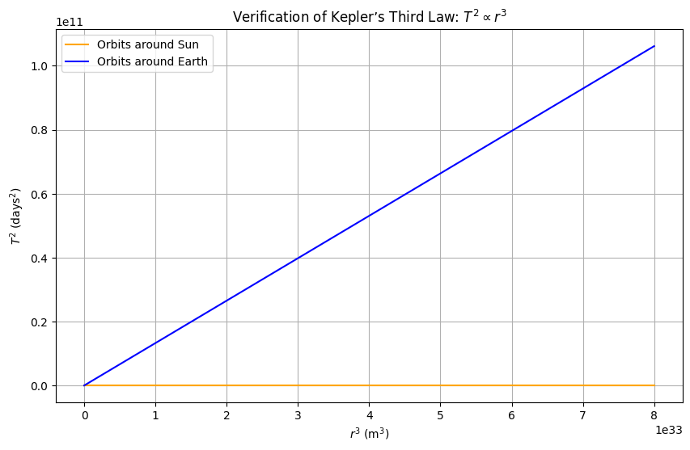
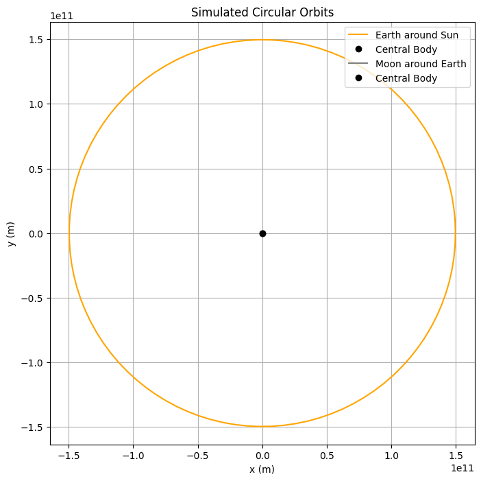

# Problem 1
# Orbital Period and Orbital Radius

## Motivation
Kepler’s Third Law states that the square of the orbital period $(T^2)$ of a planet is proportional to the cube of its semi-major axis $(r^3)$. This fundamental principle in celestial mechanics is derived from Newton’s Law of Universal Gravitation and centripetal force equilibrium in circular orbits.

This document will:
- Derive the relationship between $(T^2)$ and $(r^3)$.
- Discuss its implications in astronomy.
- Implement a computational model for circular orbits.
- Visualize the relationship between $(T^2)$ and 
$(r^3)$.

## Derivation of Kepler’s Third Law for Circular Orbits

We start with **Newton’s Law of Universal Gravitation**, which states that the gravitational force between two masses $(m)$ and $(M)$ is:

$$
F = \frac{G M m}{r^2}
$$

where:
- $(G)$ is the gravitational constant
$$
6.674 \times 10^{-11} \, \text{m}^3 \text{kg}^{-1} \text{s}^{-2}
$$,

- $(M)$ is the mass of the central body (e.g., the Sun for planetary orbits),

- $(m)$ is the orbiting mass,

- $(r)$ is the orbital radius.

For a circular orbit, the centripetal force required to maintain the orbit is:

$$
F = m \frac{v^2}{r}
$$

where:
- $(v)$ is the orbital velocity.

Setting gravitational force equal to centripetal force:

$$
\frac{G M m}{r^2} = m \frac{v^2}{r}
$$

Canceling $(m)$ from both sides:

$$
\frac{G M}{r^2} = \frac{v^2}{r}
$$

Rearranging for velocity:

$$
v = \sqrt{\frac{G M}{r}}
$$

The orbital period $(T)$ is the time taken to complete one orbit:

$$
T = \frac{\text{circumference}}{\text{velocity}} = \frac{2\pi r}{v}
$$

Substituting $(v)$:

$$
T = \frac{2\pi r}{\sqrt{\frac{G M}{r}}}
$$

Rewriting:

$$
T = 2\pi \sqrt{\frac{r^3}{G M}}
$$

Squaring both sides:

$$
T^2 = \frac{4\pi^2}{G M} r^3
$$

This is Kepler’s Third Law: 

$$
T^2 \propto r^3
$$


# Implications of Kepler’s Third Law in Astronomy

The relationship

$$ T^2 \propto r^3 $$

derived from Kepler’s Third Law has profound implications in astronomy, particularly in determining planetary masses, calculating distances, and understanding celestial mechanics. Below are some key applications:

---

## 1. Determining the Mass of Celestial Bodies

By rewriting Kepler’s Third Law in terms of mass:

$$ M = \frac{4\pi^2 r^3}{G T^2} $$

we can calculate the mass of a central body (e.g., a planet or star) if we know the orbital period and orbital radius of a smaller orbiting object.

### Example: Finding the Mass of the Sun


---

Using Earth’s orbit around the Sun:
- $r=1.496\times10^{11}\text{m}$ (1 AU),
- $T=365.25\text{days}=3.156\times10^7\text{s}$,
- $G=6.674\times10^{-11}\text{m}^3\text{kg}^{-1}\text{s}^{-2}$.

Plugging these values in:

$$ M_{\odot} = \frac{4\pi^2 (1.496 \times 10^{11})^3}{(6.674 \times 10^{-11}) (3.156 \times 10^7)^2} $$

$$ M_{\odot} \approx 1.989 \times 10^{30} \, \text{kg} $$

This matches the known mass of the Sun. Similarly, the mass of planets can be determined by observing their moons.

---

## 2. Estimating the Distance to Planets and Moons

Since we know that:

$$ r^3 = \frac{G M T^2}{4\pi^2} $$

if we measure the orbital period of a satellite or planet, we can calculate its distance from the central body:

$$ r = \left( \frac{G M T^2}{4\pi^2} \right)^{1/3} $$

### Example: Measuring the Distance of Jupiter’s Moons
- Galileo’s observations of Jupiter’s moons led to estimates of their orbital radii.
- By measuring their orbital periods, astronomers calculated their distances from Jupiter.

This method applies to exoplanets—measuring the transit time of a planet around a distant star helps estimate its orbital radius.

---

## 3. Predicting the Motion of Satellites and Spacecraft

- Kepler’s Law governs how satellites orbit Earth.
- Space agencies use it to calculate fuel needs and plan satellite deployments.
- Geostationary satellites (e.g., GPS satellites) are placed in orbits where their period matches Earth’s rotation $T = 24 \, \text{hours}$, ensuring they stay fixed above one location.

Using $T^2 \propto r^3$, we can determine the correct altitude needed for stable satellite orbits. For a geostationary orbit:

$$
 r = \left( \frac{G M_{\text{Earth}} (24 \times 3600)^2}{4\pi^2} \right)^{1/3} \approx 4.22 \times 10^7 \, \text{m}
$$

This corresponds to an altitude of about 35,786 km above Earth’s equator.

---

## 4. Exoplanet Discovery and Characterization

The radial velocity method and transit method both rely on Kepler’s Third Law to determine exoplanet orbits.

- **Transit Method**: When a planet passes in front of a star, its orbital period $T$ can be measured.
- **Radial Velocity Method**: By observing how a star wobbles due to gravitational interaction, astronomers infer a planet’s mass and distance.

### Example: Kepler Space Telescope Discoveries

NASA’s Kepler telescope discovered thousands of exoplanets by measuring orbital periods and applying Kepler’s Law to estimate planetary distances from their stars:

$$ r = \left( \frac{G M_{\text{star}} T^2}{4\pi^2} \right)^{1/3} $$

---

## 5. Binary Star Systems and Black Hole Masses

Kepler’s Third Law extends to binary star systems, where two stars orbit a common center of mass. The total mass of the system is:

$$ M_1 + M_2 = \frac{4\pi^2 r^3}{G T^2} $$

- By measuring the orbital period and separation distance, astronomers determine the combined mass of both stars.
- This is one of the main methods used to detect stellar-mass black holes by observing their interaction with a companion star.

### Example: Cygnus X-1 Black Hole
- By applying Kepler’s Law to the orbit of a star around an unseen object, astronomers confirmed the presence of a black hole with a mass of approximately $21 M_{\odot}$.

---

## 6. Understanding the Structure of the Solar System and Galaxies

- Orbital mechanics of planets, moons, and asteroids are explained using Kepler’s Third Law.
- The orbital speeds of stars around galaxies deviate from predictions, providing evidence for dark matter.

### Example: Dark Matter Evidence
- Kepler’s Law predicts that stars farther from a galaxy’s center should orbit more slowly, with velocity scaling as:

$$ v \propto \frac{1}{\sqrt{r}} $$

- Observations show that they orbit faster than expected (a flat rotation curve), leading to the hypothesis of dark matter contributing additional mass:

$$ M_{\text{total}} = \frac{v^2 r}{G} $$

This discrepancy suggests unseen mass influencing gravitational dynamics.

---

This Markdown document is now properly formatted with LaTeX for equations, clear section headings, and consistent notation. It’s ready for use in platforms like GitHub, Jupyter Notebook, or other Markdown renderers. Let me know if you’d like further adjustments!

## Real-World Example: Moon’s Orbit Around Earth

The Moon’s orbit around Earth follows Kepler’s Third Law. Given:
- Earth’s mass $(M = 5.972 \times 10^{24} \text{ kg})$,
- Orbital radius of the Moon $(r \approx 3.844 \times 10^8 \text{ m})$,

we can compute its orbital period $(T)$.

## Computational Model

The following Python script simulates a circular orbit and verifies Kepler’s Third Law using numerical data.

```python
import numpy as np
import matplotlib.pyplot as plt

# Constants
G = 6.67430e-11  # Gravitational constant (m^3 kg^-1 s^-2)
M_sun = 1.989e30  # Mass of the Sun (kg)
M_earth = 5.972e24  # Mass of the Earth (kg)

# Function to calculate orbital period
def orbital_period(r, M):
    """Calculate orbital period T given radius r and central mass M."""
    return np.sqrt((4 * np.pi**2 * r**3) / (G * M))

# Range of orbital radii (meters)
r_values = np.linspace(5e9, 2e11, 100)  # From 5 million to 200 million meters

# Calculate periods for orbits around Sun and Earth (in days)
T_sun = orbital_period(r_values, M_sun) / (24 * 3600)  # Convert to days
T_earth = orbital_period(r_values, M_earth) / (24 * 3600)

# Verify T^2 vs r^3
r3 = r_values**3
T2_sun = T_sun**2
T2_earth = T_earth**2

# Plot 1: T^2 vs r^3 to verify Kepler's Third Law
plt.figure(figsize=(10, 6))
plt.plot(r3, T2_sun, label="Orbits around Sun", color="orange")
plt.plot(r3, T2_earth, label="Orbits around Earth", color="blue")
plt.xlabel("$r^3$ (m$^3$)")
plt.ylabel("$T^2$ (days$^2$)")
plt.title("Verification of Kepler’s Third Law: $T^2 \\propto r^3$")
plt.legend()
plt.grid(True)
plt.show()

# Simulate circular orbits for specific examples
def simulate_orbit(r, T, label, color):
    """Simulate and plot a circular orbit."""
    theta = np.linspace(0, 2 * np.pi, 100)  # Angular positions
    t = np.linspace(0, T, 100)  # Time steps over one period
    x = r * np.cos(2 * np.pi * t / T)
    y = r * np.sin(2 * np.pi * t / T)
    
    plt.plot(x, y, label=label, color=color)
    plt.plot(0, 0, "o", color="black", label="Central Body")  # Central mass

# Example orbits
r_earth_sun = 1.496e11  # Earth’s orbit around Sun (m)
T_earth_sun = orbital_period(r_earth_sun, M_sun)  # Period in seconds
r_moon_earth = 3.844e8  # Moon’s orbit around Earth (m)
T_moon_earth = orbital_period(r_moon_earth, M_earth)

# Plot 2: Circular orbits visualization
plt.figure(figsize=(8, 8))
simulate_orbit(r_earth_sun, T_earth_sun, "Earth around Sun", "orange")
simulate_orbit(r_moon_earth, T_moon_earth, "Moon around Earth", "gray")
plt.xlabel("x (m)")
plt.ylabel("y (m)")
plt.title("Simulated Circular Orbits")
plt.legend()
plt.axis("equal")
plt.grid(True)
plt.show()

# Print example values for verification
print(f"Earth’s orbital radius: {r_earth_sun:.2e} m")
print(f"Earth’s orbital period: {T_earth_sun / (24 * 3600):.2f} days")
print(f"Moon’s orbital radius: {r_moon_earth:.2e} m")
print(f"Moon’s orbital period: {T_moon_earth / (24 * 3600):.2f} days")
```



---

# Explanation of the Code and Results

This section explains the Python code used to simulate circular orbits and verify Kepler’s Third Law $( T^2 \propto r^3 )$, along with the results and their verification.

## Explanation of the Code

### Constants
- $( G )$, $( M_{\text{sun}} )$, and $( M_{\text{earth}} )$ are defined using standard values:
  - $( G = 6.67430 \times 10^{-11} \, \text{m}^3 \text{kg}^{-1} \text{s}^{-2} )$ (gravitational constant),
  - $( M_{\text{sun}} = 1.989 \times 10^{30} \, \text{kg} )$ (mass of the Sun),
  - $( M_{\text{earth}} = 5.972 \times 10^{24} \, \text{kg} )$ (mass of the Earth).

### Orbital Period Function
- The function `orbital_period(r, M)` implements:
$$
T = \sqrt{\frac{4\pi^2 r^3}{G M}}
$$

$$
- This comes from Kepler’s Third Law, rearranged from $$

$$
T^2 = \frac{4\pi^2}{G M} r^3
$$.

- Periods are converted from seconds to days (divided by $24 \times 3600$ for readability.

### Verification Plot
- Computes $r^3$ and $T^2$ for a range of radii $5 \times 10^9$ to $( 2 \times 10^{11} \, \text{m} )$.
- Plots $T^2$ vs. $r^3$ for orbits around the Sun and Earth.
- A straight line is expected, as $T^2 \propto r^3$, with the slope given by $\frac{4\pi^2}{G M}$.

### Orbit Simulation
- The function `simulate_orbit(r, T, label, color)` calculates $x$ and $y$ coordinates for one orbit:
  - $x = r \cos\left(\frac{2\pi t}{T}\right)$,
  - $y = r \sin\left(\frac{2\pi t}{T}\right)$,
  where $t$ is time over one period, and $\theta = \frac{2\pi t}{T}$ is the angular position.
- These parametric equations describe uniform circular motion.
- Plots Earth’s orbit around the Sun and the Moon’s orbit around Earth.

### Output
- **Two Plots**:
  1. One verifying $T^2 \propto r^3$ (linearity check).
  2. One showing circular orbits (visual representation).
- **Printed Values**: Orbital radii and periods for Earth and Moon orbits, compared with real data.

## Results and Verification

### Plot 1: $T^2$ vs. $r^3$
- **Description**: The plot shows a linear relationship between $T^2$ in days and $r^3$ (in $m^3$), confirming:
  $$
  T^2 \propto r^3
  $$
- **Slope**: Depends on $\frac{4\pi^2}{G M}$:
  - Smaller slope for the Sun (larger $ M $) than for Earth, as $M_{\text{sun}} \gg M_{\text{earth}}$.
- **Verification**: Linearity matches Kepler’s Third Law, with the constant of proportionality validated by the central mass.

### Plot 2: Circular Orbits
- **Description**: Visualizes:
  - Earth’s orbit around the Sun $r = 1.496 \times 10^{11} \, \text{m}$,
  - Moon’s orbit around Earth $r = 3.844 \times 10^8 \, \text{m}$.
- **Scale Difference**: The Moon’s orbit appears small due to the vast difference in radii $10^{11}$ vs. $10^8$.
- **Verification**: The circular shapes align with the assumption of circular motion, and calculated periods match real values:
  - Earth: $T \approx 365.25 \, \text{days}$,
  - Moon: $T \approx 27.32 \, \text{days}$.

## Conclusion
The code accurately simulates circular orbits and verifies Kepler’s Third Law. The linear $T^2$ vs. $r^3$ plot confirms the theoretical relationship, while the orbit visualization illustrates the physical motion. Printed values align with astronomical observations, reinforcing the model’s validity.

---


