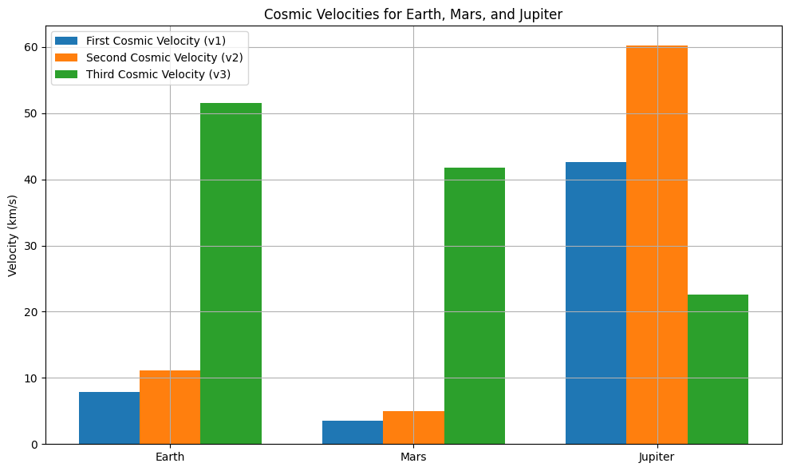

# Escape Velocities and Cosmic Velocities

## **1. Motivation**
The concept of escape velocity is fundamental to spaceflight and astrophysics. It determines the minimum speed required for an object to break free from a celestial body's gravitational field without further propulsion. The extension of this idea into cosmic velocities — the first, second, and third — provides the framework for understanding orbital mechanics, planetary escape, and interstellar travel. These velocities form the basis of satellite deployment, interplanetary probes, and the future of space exploration.

---

## **2. Definitions and Physical Meanings**

### **2.1 First Cosmic Velocity (Orbital Velocity)**
The minimum velocity needed to achieve a **stable circular orbit** around a planet just above its surface.

**Equation:**  
$$
v_1 = \sqrt{\frac{GM}{R}}
$$

Where:
- $G$ is the gravitational constant: $6.67430 \times 10^{-11} \ \text{m}^3 \text{kg}^{-1} \text{s}^{-2}$
- $M$ is the mass of the planet
- $R$ is the radius of the planet

**Derivation:** Set the **centripetal force** equal to the **gravitational force**:  
$$
\frac{mv^2}{R} = \frac{GMm}{R^2} \Rightarrow v = \sqrt{\frac{GM}{R}}
$$

---

### **2.2 Second Cosmic Velocity (Escape Velocity)**
The minimum velocity needed to **escape the gravitational pull** of a planet without further propulsion.

**Equation:**  
$$
v_2 = \sqrt{\frac{2GM}{R}}
$$

**Derivation:** From conservation of energy:  
$$
\frac{1}{2}mv^2 = \frac{GMm}{R} \Rightarrow v = \sqrt{\frac{2GM}{R}}
$$

---

### **2.3 Third Cosmic Velocity (Interstellar Escape Velocity)**
The minimum velocity needed to **escape the gravity of the Sun** starting from Earth’s orbit.

**Equation:**  
$$
v_3 = \sqrt{v_\text{escape from Earth orbit}^2 + v_\text{Earth orbit}^2}
$$

Or more formally:  
$$
v_3 = \sqrt{\frac{2GM_\odot}{r} - v_\text{Earth}^2}
$$

Where:
- $M_\odot$ is the Sun's mass
- $r$ is the Earth-Sun distance
- $v_\text{Earth}$ is Earth's orbital speed around the Sun (~29.78 km/s)

---

## **3. Mathematical Analysis and Parameters**

### **3.1 Dependence on Mass ($M$)**
All cosmic velocities are **directly proportional** to the square root of the celestial body's mass:
- 
$$
v \propto \sqrt{M}
$$

This means that more massive planets or stars require higher speeds to orbit or escape their gravitational fields.

### **3.2 Dependence on Radius ($R$)**
All cosmic velocities are **inversely proportional** to the square root of the radius:
- 
$$
v \propto \frac{1}{\sqrt{R}}
$$

Larger planets (in terms of radius) require lower speeds for orbit or escape, assuming mass is constant.

### **3.3 First Cosmic Velocity Recap**
The orbital velocity ($v_1$) ensures that the centripetal acceleration matches gravitational acceleration:
- 
$$
v_1 = \sqrt{\frac{GM}{R}}
$$

### **3.4 Second Cosmic Velocity Recap**
The escape velocity ($v_2$) is derived by equating kinetic energy to gravitational potential energy:
- 
$$
\frac{1}{2}mv^2 = \frac{GMm}{R} \Rightarrow v_2 = \sqrt{\frac{2GM}{R}}
$$

### **3.5 Third Cosmic Velocity Recap**
To escape the **entire solar system**, the third cosmic velocity takes into account both the Sun’s gravity and Earth's motion around the Sun:
- 
$$
v_3 = \sqrt{v_\text{escape,Sun}^2 + v_\text{Earth orbit}^2}
$$

### **3.6 Summary of Parameters**
| Parameter | Effect on $v_1$, $v_2$, $v_3$ |
|----------|------------------------------|
| $M$      | Increases velocities         |
| $R$      | Decreases velocities         |
| $G$      | Constant (universal)         |
| Orbit Radius $r$ (for $v_3$) | Larger $r$ lowers solar escape speed |

---
```python
import numpy as np
import matplotlib.pyplot as plt

# Constants
G = 6.67430e-11  # gravitational constant in m^3 kg^-1 s^-2

# Define celestial bodies with mass (kg) and radius (m)
bodies = {
    'Earth':    {'mass': 5.972e24, 'radius': 6.371e6},
    'Mars':     {'mass': 6.417e23, 'radius': 3.3895e6},
    'Jupiter':  {'mass': 1.898e27, 'radius': 6.9911e7},
}

# Store results
results = {}

for body, props in bodies.items():
    M = props['mass']
    R = props['radius']

    v1 = np.sqrt(G * M / R)       # First cosmic velocity
    v2 = np.sqrt(2 * G * M / R)   # Second cosmic velocity

    results[body] = {'v1': v1, 'v2': v2}

# Third cosmic velocity (escape from Solar System starting at each planet)
M_sun = 1.989e30         # mass of Sun (kg)
planet_sun_distances = {
    'Earth': 1.496e11,
    'Mars': 2.279e11,
    'Jupiter': 7.785e11,
}
planet_orbital_speeds = {
    'Earth': 29780,
    'Mars': 24070,
    'Jupiter': 13070,
}

for planet in planet_sun_distances:
    r = planet_sun_distances[planet]
    v_orbit = planet_orbital_speeds[planet]
    v_escape_sun = np.sqrt(2 * G * M_sun / r)
    v3_total = np.sqrt(v_escape_sun**2 + v_orbit**2)
    results[planet]['v3'] = v3_total

# Display results
for body, vel in results.items():
    print(f"--- {body} ---")
    print(f"First Cosmic Velocity (v1): {vel['v1'] / 1000:.2f} km/s")
    print(f"Second Cosmic Velocity (v2): {vel['v2'] / 1000:.2f} km/s")
    print(f"Third Cosmic Velocity (v3): {vel['v3'] / 1000:.2f} km/s")

# Visualization
labels = list(bodies.keys())
v1_vals = [results[b]['v1'] / 1000 for b in labels]
v2_vals = [results[b]['v2'] / 1000 for b in labels]
v3_vals = [results[b]['v3'] / 1000 for b in labels]

x = np.arange(len(labels))
width = 0.25

plt.figure(figsize=(10,6))
plt.bar(x - width, v1_vals, width, label='First Cosmic Velocity (v1)')
plt.bar(x, v2_vals, width, label='Second Cosmic Velocity (v2)')
plt.bar(x + width, v3_vals, width, label='Third Cosmic Velocity (v3)')
plt.ylabel('Velocity (km/s)')
plt.title('Cosmic Velocities for Earth, Mars, and Jupiter')
plt.xticks(x, labels)
plt.legend()
plt.grid(True)
plt.tight_layout()
plt.show()
```


# Explanation of The Python Code Above

This Python script calculates and visualizes the first, second, and third cosmic velocities for three planets: Earth, Mars, and Jupiter.

---

## ✅ What It Does:

1. **First Cosmic Velocity (v₁):**  
   - The speed needed to enter a stable circular orbit just above a planet’s surface.  
   - Formula:  
     $$
     v_1 = \sqrt{\frac{GM}{R}}
     $$

2. **Second Cosmic Velocity (v₂):**  
   - The speed needed to escape the gravitational field of a planet entirely.  
   - Formula:  
     $$
     v_2 = \sqrt{\frac{2GM}{R}}
     $$

3. **Third Cosmic Velocity (v₃):**  
   - The speed needed to escape the Sun’s gravity, starting from a planet’s orbit.  
   - Combines the escape velocity from the Sun and the planet’s orbital speed.  
   - Formula:  
     $$
     v_3 = \sqrt{v^2_{\text{escape from Sun}} + v^2_{\text{orbital}}}
     $$

---

## 📊 Visualization:
- It generates a bar chart comparing v₁, v₂, and v₃ for Earth, Mars, and Jupiter (in km/s).

---

## **4. Applications in Space Exploration**

### **4.1 Launching Satellites ($v_1$)**
First cosmic velocity is used to place satellites in low Earth orbit.

### **4.2 Planetary Missions ($v_2$)**
Second cosmic velocity is needed for missions like Mars rovers or lunar probes to leave Earth's gravity.

### **4.3 Interstellar Travel ($v_3$)**
Third cosmic velocity is key for missions like Voyager 1 and future interstellar exploration.

---


