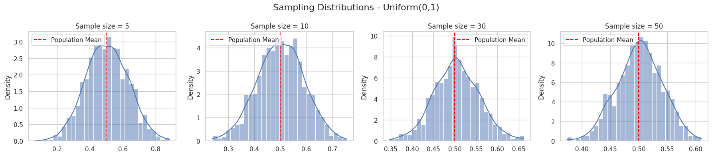
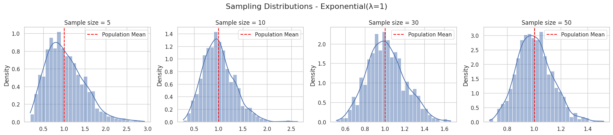
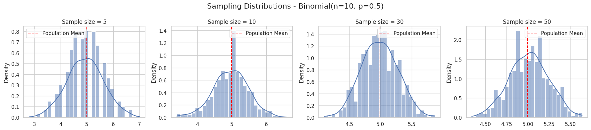
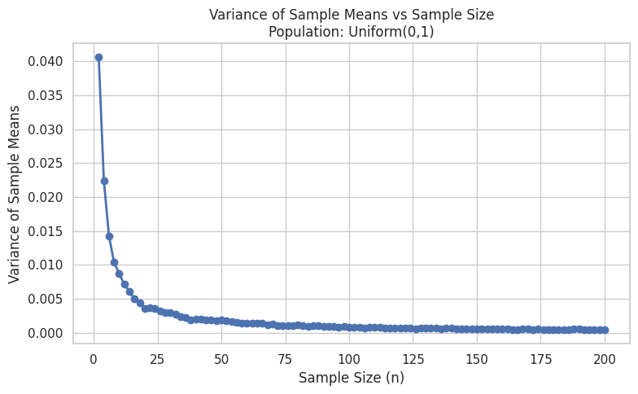
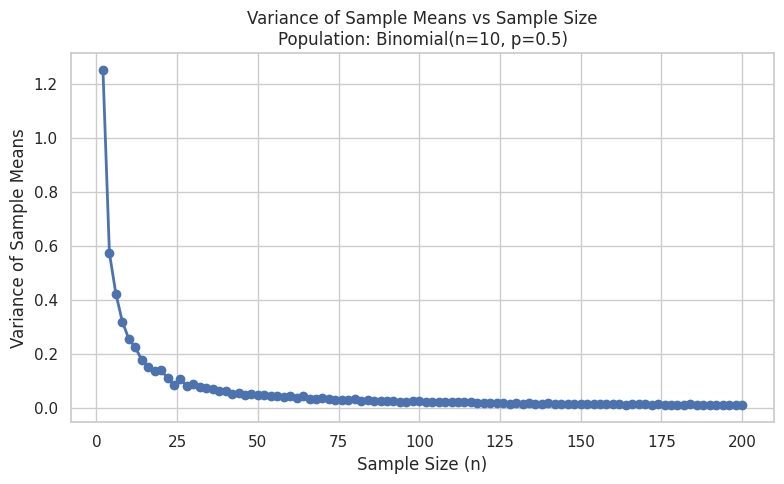

# Problem 1
# 📊 Central Limit Theorem Simulation and Analysis

## 🧠 Motivation

The **Central Limit Theorem (CLT)** is one of the most important results in statistics. It states:

> Given a sufficiently large sample size from a population with finite mean ($\mu$) and finite variance ($\sigma^2$), the sampling distribution of the sample mean will be approximately normally distributed, regardless of the population’s original distribution.

This simulation-based study provides a hands-on exploration of the CLT using Python.

---

## 📌 1. Simulating Sampling Distributions

### Population Distributions

We explore the CLT using three different types of distributions:

1. **Uniform Distribution:**  
   $$
   X \sim \text{Uniform}(a, b), \quad f(x) = \frac{1}{b-a} \text{ for } a \leq x \leq b
   $$

2. **Exponential Distribution:**  
   $$
   X \sim \text{Exponential}(\lambda), \quad f(x) = \lambda e^{-\lambda x} \text{ for } x \geq 0
   $$

3. **Binomial Distribution:**  
   $$
   X \sim \text{Binomial}(n, p), \quad P(X = k) = \binom{n}{k} p^k (1-p)^{n-k}
   $$

---

## 🧪 2. Sampling and Visualization

```python
import numpy as np
import matplotlib.pyplot as plt
import seaborn as sns

sns.set(style='whitegrid')

def simulate_clt(distribution_name, pop_data, sample_sizes=[5, 10, 30, 50], n_simulations=1000):
    fig, axes = plt.subplots(1, len(sample_sizes), figsize=(18, 4))
    fig.suptitle(f'Sampling Distributions - {distribution_name}', fontsize=16)
    
    for idx, size in enumerate(sample_sizes):
        sample_means = [np.mean(np.random.choice(pop_data, size, replace=True)) for _ in range(n_simulations)]
        
        sns.histplot(sample_means, kde=True, ax=axes[idx], bins=30, stat="density")
        axes[idx].set_title(f'Sample size = {size}')
        axes[idx].axvline(np.mean(pop_data), color='red', linestyle='--', label='Population Mean')
        axes[idx].legend()
    
    plt.tight_layout()
    plt.show()

# Generate population data
np.random.seed(42)
N = 100000  # Population size

# 1. Uniform(0, 1)
uniform_data = np.random.uniform(0, 1, N)
simulate_clt("Uniform(0,1)", uniform_data)

# 2. Exponential(λ=1)
exp_data = np.random.exponential(scale=1, size=N)
simulate_clt("Exponential(λ=1)", exp_data)

# 3. Binomial(n=10, p=0.5)
binom_data = np.random.binomial(n=10, p=0.5, size=N)
simulate_clt("Binomial(n=10, p=0.5)", binom_data)
```




---

## 📐 3. Parameter Exploration

### A. Effect of Sample Size

- **Small sample size ($n=5$):** Sampling distribution retains the original distribution’s shape.
- **Large sample size ($n=30+$):** Distribution of sample means becomes bell-shaped and symmetric.

### B. Effect of Population Variance

From theory:

$$
\text{Var}(\bar{X}) = \frac{\sigma^2}{n}
$$

Where:

- $\bar{X}$: sample mean  
- $\sigma^2$: population variance  
- $n$: sample size  

As $n$ increases, the variance of the sampling distribution decreases. The distribution becomes narrower, meaning more precise estimates of the population mean.

### C. Visual Example: Varying Variance

```python
def plot_variance_effect(data, sample_size=30):
    sample_means = [np.mean(np.random.choice(data, sample_size, replace=True)) for _ in range(1000)]
    plt.figure(figsize=(7, 4))
    sns.histplot(sample_means, kde=True, stat="density")
    plt.axvline(np.mean(data), color='red', linestyle='--', label='Population Mean')
    plt.title(f'Sample Mean Distribution (n={sample_size})')
    plt.xlabel('Sample Mean')
    plt.ylabel('Density')
    plt.legend()
    plt.show()

# Call for examples
plot_variance_effect(exp_data)
plot_variance_effect(uniform_data)
```

---

## 📉 Variance vs. Sample Size

```python

import numpy as np
import matplotlib.pyplot as plt
import seaborn as sns

sns.set(style="whitegrid")
np.random.seed(42)

# Popülasyon verisi üretimi
N = 100000
pop_uniform = np.random.uniform(0, 1, N)
pop_exponential = np.random.exponential(scale=1, size=N)
pop_binomial = np.random.binomial(n=10, p=0.5, size=N)

populations = {
    "Uniform(0,1)": pop_uniform,
    "Exponential(λ=1)": pop_exponential,
    "Binomial(n=10, p=0.5)": pop_binomial
}

# Varyans vs Örneklem Boyutu çizimi
def plot_variance_vs_sample_size(population, pop_name):
    sample_sizes = np.arange(2, 201, 2)  # 2'den 200'e kadar örneklem boyutları
    sample_variances = []

    for n in sample_sizes:
        sample_means = [np.mean(np.random.choice(population, n, replace=True)) for _ in range(500)]
        sample_variances.append(np.var(sample_means))

    plt.figure(figsize=(8, 5))
    plt.plot(sample_sizes, sample_variances, marker='o', linewidth=2)
    plt.title(f'Variance of Sample Means vs Sample Size\nPopulation: {pop_name}')
    plt.xlabel('Sample Size (n)')
    plt.ylabel('Variance of Sample Means')
    plt.grid(True)
    plt.tight_layout()
    plt.show()
    

# Tüm dağılımlar için çiz
for name, data in populations.items():
    plot_variance_vs_sample_size(data, name)
 ```
 
 
 
 

These plots demonstrate how the **variance of sample means decreases** as the **sample size increases**, which is a key implication of the **Central Limit Theorem (CLT)**.

### 🔍 Code Explanation

- The code runs simulations for three population distributions: **Uniform**, **Exponential**, and **Binomial**.
- For each sample size (from $n = 2$ to $n = 200$):
  - 500 samples are drawn with replacement.
  - The mean of each sample is calculated.
  - The variance of these 500 sample means is computed.
- A line plot is generated showing **sample size vs. variance of sample means**.

### 📌 Theoretical Background

The variance of the sampling distribution of the mean is given by:

$$
\text{Var}(\bar{X}) = \frac{\sigma^2}{n}
$$

This formula tells us that as the sample size ($n$) increases, the variance of the sample mean **decreases**. In other words, the distribution of sample means becomes **tighter** around the population mean.

### 📈 Plot Interpretation

- The x-axis represents the **sample size**.
- The y-axis represents the **variance of the sample means**.
- For all distributions, we observe a **decline in variance** as sample size increases.
- This confirms that larger samples yield more **precise estimates** of the population mean, in accordance with the CLT.

## 🌍 4. Practical Applications of CLT

### ✅ Estimating Population Parameters

The CLT allows us to construct **confidence intervals** around the sample mean, assuming a normal distribution of the sampling distribution:

$$
\bar{X} \pm z^* \cdot \frac{\sigma}{\sqrt{n}}
$$

Where:

- $\bar{X}$: sample mean  
- $z^*$: critical value from standard normal distribution (e.g., 1.96 for 95% CI)  
- $\sigma$: population standard deviation  
- $n$: sample size  

### 🏭 Quality Control

In manufacturing, companies use samples to monitor process performance. The CLT allows interpretation of sample means over time to detect defects or shifts in the process.

### 💹 Finance and Risk

Risk analysts use the CLT to assume normality when modeling average returns, enabling value-at-risk (VaR) calculations and financial forecasting.

---

## 📚 Conclusion

- The **Central Limit Theorem** confirms that the distribution of sample means converges to normality as sample size increases, regardless of the original population shape.
- Simulations verify this behavior for uniform, exponential, and binomial distributions.
- Larger sample sizes reduce the variance of the sample mean, increasing the accuracy of estimates.

---

## 📎 References & Resources

- Khan Academy — Central Limit Theorem
- OpenIntro Statistics (free textbook)
- Python Libraries:
  - NumPy
  - Matplotlib
  - Seaborn

