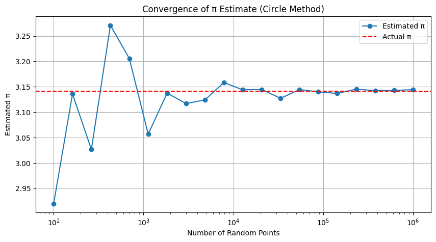

# Problem 2
# Estimating π Using Monte Carlo Methods

## Motivation

Monte Carlo simulations use randomness to solve numerical and geometric problems. Estimating π is a classic example. This document includes two methods:

1. **Circle-based Monte Carlo method**
2. **Buffon’s Needle method**

---

# Part 1: Estimating π Using Circle-Based Monte Carlo Method

## 1. Theoretical Background

A unit circle is inscribed in a square of side 2. The area of the circle is:

$$
A_{\text{circle}} = \pi r^2 = \pi
$$

The area of the square is:

$$
A_{\text{square}} = (2r)^2 = 4
$$

So the ratio:

$$
\frac{A_{\text{circle}}}{A_{\text{square}}} = \frac{\pi}{4}
\Rightarrow
\pi \approx 4 \cdot \frac{\text{points inside the circle}}{\text{total points}}
$$
---
## Python implementation
```python
import numpy as np
import matplotlib.pyplot as plt

# --- Part 1: Monte Carlo Circle Method ---

def estimate_pi(num_points):
    x = np.random.uniform(-1, 1, num_points)
    y = np.random.uniform(-1, 1, num_points)
    distance = x**2 + y**2
    inside_circle = distance <= 1
    pi_estimate = 4 * np.sum(inside_circle) / num_points
    return pi_estimate, x, y, inside_circle

# Single run and scatter plot
num_points = 10000
pi_estimate, x, y, inside = estimate_pi(num_points)

plt.figure(figsize=(6, 6))
plt.scatter(x[inside], y[inside], color='blue', s=1, label="Inside Circle")
plt.scatter(x[~inside], y[~inside], color='red', s=1, label="Outside Circle")
plt.title(f"Monte Carlo π Estimation\nEstimated π = {pi_estimate:.5f}")
plt.xlabel("x")
plt.ylabel("y")
plt.legend()
plt.axis("equal")
plt.grid(True)
plt.show()

# Convergence graph
sample_sizes = np.logspace(2, 6, 20, dtype=int)
estimates = [estimate_pi(n)[0] for n in sample_sizes]

plt.figure(figsize=(10, 5))
plt.plot(sample_sizes, estimates, marker='o', label='Estimated π')
plt.axhline(np.pi, color='r', linestyle='--', label='Actual π')
plt.xscale('log')
plt.xlabel('Number of Random Points')
plt.ylabel('Estimated π')
plt.title('Convergence of π Estimate (Circle Method)')
plt.legend()
plt.grid(True)
plt.show()
```
##  Explanation of Monte Carlo Circle π Estimation Code

This Python code estimates the value of π using the **Monte Carlo method** by simulating random points in a square and checking how many fall inside an inscribed unit circle.

### 🔹 Step-by-Step Breakdown:

1. **Function `estimate_pi(num_points)`**:
   - Generates `num_points` random $(x, y)$ coordinates within the square $[-1, 1] \times [-1, 1]$.
   - Calculates the distance of each point from the origin.
   - Counts how many points fall **inside the unit circle** using the condition $x^2 + y^2 \le 1$.
   - Estimates π with the formula:
     $$
     \pi \approx 4 \cdot \frac{\text{Number inside circle}}{\text{Total points}}
     $$

2. **Scatter Plot Visualization**:
   - Shows blue dots for points inside the circle and red for those outside.
   - Helps visualize the geometric probability that underlies the method.

3. **Convergence Plot**:
   - Runs the simulation for increasing numbers of points (from $10^2$ to $10^6$).
   - Plots the estimated π values against the number of points.
   - Includes a dashed horizontal line at the true value of π to observe how fast the estimation converges.

This method beautifully demonstrates how randomness can be used to approximate mathematical constants like π using geometry and probability.

## 3. Visualization

*A scatter plot shows inside-circle points in blue and outside-circle points in red.*


## 4. Convergence Analysis

*A plot of estimated π versus number of points (log scale) shows convergence to real π.*



---

# Part 2: Estimating π Using Buffon’s Needle

## 1. Theoretical Background

If a needle of length $\ell$ is dropped onto a plane with parallel lines spaced distance $d$ apart, the probability it crosses a line is:

$$
P = \frac{2\ell}{d\pi}
\Rightarrow
\pi \approx \frac{2\ell \cdot N}{d \cdot H}
$$

Where:
- $N$ = total number of throws
- $H$ = number of crossings
---
## Python implementation
```python
import numpy as np
import matplotlib.pyplot as plt

# --- Part 2: Buffon’s Needle Method ---

# π estimation function using Buffon's Needle experiment
def buffon_needle(num_needles, needle_length=1.0, line_distance=1.0):
    hits = 0
    for _ in range(num_needles):
        center = np.random.uniform(0, line_distance / 2)  # Distance from center to nearest line
        angle = np.random.uniform(0, np.pi / 2)           # Random angle between 0 and 90 degrees
        if center <= (needle_length / 2) * np.sin(angle):  # Crossing condition
            hits += 1
    if hits == 0:
        return None  # Avoid division by zero
    return (2 * needle_length * num_needles) / (line_distance * hits)

# Run the simulation with 10,000 needles
estimated_pi_buffon = buffon_needle(10000)
print(f"Estimated π using Buffon's Needle: {estimated_pi_buffon:.5f}")

# Optional: Visualize the needle drops
def buffon_visualize(num_needles=100, needle_length=1.0, line_distance=1.0):
    plt.figure(figsize=(10, 6))
    
    # Draw parallel lines
    for i in range(6):
        plt.axhline(i * line_distance, color='gray', linestyle='--')

    # Drop needles
    for _ in range(num_needles):
        y_center = np.random.uniform(0, 5)
        theta = np.random.uniform(0, np.pi)
        dy = (needle_length / 2) * np.sin(theta)
        y1 = y_center - dy
        y2 = y_center + dy
        color = 'blue' if int(y1 / line_distance) != int(y2 / line_distance) else 'red'
        plt.plot([0, 1], [y1, y2], color=color)

    plt.title("Buffon's Needle Simulation")
    plt.xlim(0, 1)
    plt.ylim(0, 5)
    plt.xlabel("Needle Span")
    plt.ylabel("Parallel Lines")
    plt.grid(True)
    plt.show()

# Run visualization
buffon_visualize()

# Convergence graph for different needle counts
needle_counts = np.logspace(2, 5, 10, dtype=int)
estimates_buffon = [buffon_needle(n) for n in needle_counts]

plt.figure(figsize=(10, 5))
plt.plot(needle_counts, estimates_buffon, marker='o', label='Estimated π')
plt.axhline(np.pi, color='r', linestyle='--', label='Actual π')
plt.xscale('log')
plt.xlabel('Number of Needle Drops')
plt.ylabel('Estimated π')
plt.title("Convergence of π Estimate (Buffon's Needle)")
plt.legend()
plt.grid(True)
plt.show()
```


## 🪡 Explanation of Buffon’s Needle π Estimation Code

This code estimates the value of π using the **Buffon’s Needle experiment**, a probabilistic geometric method based on randomly dropping a needle on a surface with parallel lines.

### 🔹 Step-by-Step Breakdown:

1. **Function `buffon_needle(num_needles)`**:
   - Simulates dropping `num_needles` on a plane with parallel lines spaced a fixed distance `d` apart.
   - For each needle:
     - A **random center distance** from the closest line is generated.
     - A **random angle** of orientation (between 0 and 90 degrees) is picked.
     - The needle is considered **"crossing a line"** if:
       $$
       \text{center distance} \leq \frac{\ell}{2} \cdot \sin(\theta)
       $$
   - If $H$ is the number of hits (crossings), π is estimated with:
     $$
     \pi \approx \frac{2 \ell N}{d H}
     $$

2. **Simulation Execution**:
   - The function is run for 10,000 needles and prints an estimated value of π.

3. **Visualization (`buffon_visualize`)**:
   - Visually drops 100 needles between horizontal parallel lines.
   - **Blue needles** cross a line; **red needles** do not.
   - This helps build geometric intuition behind the probability calculation.

4. **Convergence Plot**:
   - Runs simulations for increasing numbers of needles (from $10^2$ to $10^5$).
   - Plots estimated π against needle count on a log scale.
   - Shows how the estimate stabilizes and converges to real π as sample size increases.

---

This experiment not only offers a historical and elegant way to compute π, but also beautifully demonstrates how geometry, probability, and simulation can work together.

## 3. Visualization

*A plot shows many needles dropped on parallel lines, with crossing ones in blue, others in red.*


## 4. Convergence Analysis

*A plot shows estimated π versus number of drops on log scale.*


---

# Final Comparison

| Method             | Formula                                          | Speed     | Accuracy    | Visual Intuition |
|--------------------|--------------------------------------------------|-----------|-------------|------------------|
| Circle Monte Carlo | $\pi \approx 4 \cdot \frac{\text{hits}}{\text{total}}$ | Fast      | High with $10^5$+ | Very clear       |
| Buffon’s Needle    | $\pi \approx \frac{2\ell N}{d H}$               | Slower    | Lower with small $N$ | Historical & interesting |

---

## References

- Buffon’s Needle: [Wikipedia](https://en.wikipedia.org/wiki/Buffon%27s_needle)  
- Monte Carlo Method: [Wikipedia](https://en.wikipedia.org/wiki/Monte_Carlo_method)