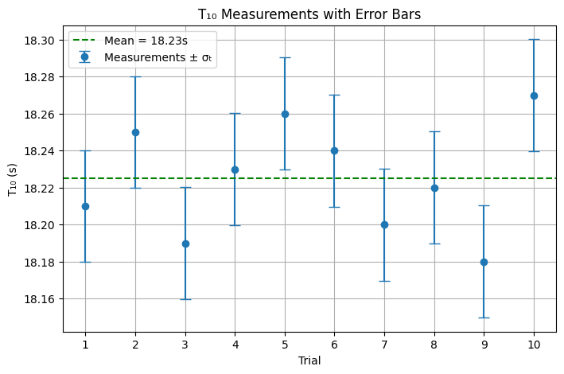
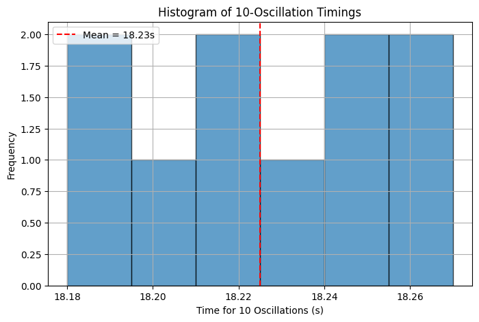
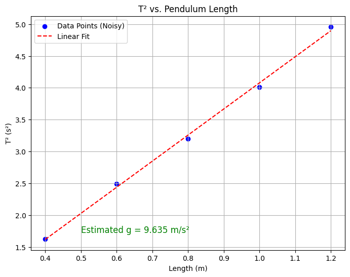

# Problem 1
# 📌 Measuring Earth’s Gravitational Acceleration with a Pendulum


## 🔷 Motivation

The acceleration due to gravity, **$g$**, is a fundamental physical constant that governs the motion of objects and underpins many areas of physics and engineering. A **simple pendulum** offers a time-tested experimental method to determine $g$ through the relationship between its length and period of oscillation.

From the formula:

$$
T = 2\pi \sqrt{\frac{L}{g}} \Rightarrow g = \frac{4\pi^2 L}{T^2}
$$

we can measure the period $T$ and length $L$ to estimate the local gravitational acceleration $g$.

---

## 🔷 Task

- Measure $g$ using a pendulum.
- Analyze the **uncertainties** in your measurements.
- Understand how measurement accuracy impacts scientific results.

---

## 🔷 Procedure

### 1. Materials

- A string (1–1.5 meters long)
- A small weight (e.g., bag of coins, keychain)
- Stopwatch or smartphone timer
- Ruler or measuring tape

---

### 2. Setup

- Suspend the weight from the string and fix the upper end to a stable support.
- Measure the **length $L$** from the suspension point to the center of mass of the weight.

#### Uncertainty in Length:

If the ruler has a resolution $R$, then the uncertainty is:

$$
\Delta L = \frac{R}{2}
$$

---

### 3. Data Collection

1. Displace the pendulum by less than $15^\circ$ and release it.
2. Measure the time for **10 full oscillations**, denoted $T_{10,i}$ for $i = 1$ to $10$.
3. Repeat this measurement 10 times.
4. Compute the **mean time** for 10 oscillations:

$$
\bar{T}_{10} = \frac{1}{10} \sum_{i=1}^{10} T_{10,i}
$$

5. Compute the **standard deviation**:

$$
\sigma_t = \sqrt{ \frac{1}{n - 1} \sum_{i=1}^{10} \left(T_{10,i} - \bar{T}_{10} \right)^2 }
$$

6. Calculate the **uncertainty in the mean**:

$$
\Delta T_{10} = \frac{\sigma_t}{\sqrt{n}} \quad \text{where } n = 10
$$

---

## 🔷 Calculations

### 1. Period of One Oscillation

$$
T = \frac{\bar{T}_{10}}{10}, \quad \Delta T = \frac{\Delta T_{10}}{10}
$$

---

### 2. Gravitational Acceleration

Using the pendulum formula:

$$
g = \frac{4\pi^2 L}{T^2}
$$

---

### 3. Uncertainty in $g$ (Propagation of Uncertainties)

Apply the uncertainty propagation formula:

$$
\Delta g = g \cdot \sqrt{ \left( \frac{\Delta L}{L} \right)^2 + \left( 2 \cdot \frac{\Delta T}{T} \right)^2 }
$$

---

## 🔷 Analysis

### 1. Comparison with Standard Value

Compare the measured value of $g$ with the known standard:

$$
g_{\text{measured}} \quad \text{vs} \quad g_{\text{standard}} = 9.81 \ \text{m/s}^2
$$

---

### 2. Discussion Points

- **Effect of Measurement Resolution on $\Delta L$**  
  A coarser ruler (e.g., 1 cm resolution) results in higher uncertainty:
  $$
  \Delta L = 0.005 \ \text{m}
  $$

- **Timing Variability and Impact on $\Delta T$**  
  Human reaction time during stopwatch usage introduces random errors, which increase $\sigma_t$ and $\Delta T$.

- **Assumptions and Limitations**:
  - Small-angle approximation: Valid only for $\theta < 15^\circ$.
  - Neglects air resistance, friction at the pivot, and mass of the string.
  - Assumes a rigid, non-stretching string.

---

## 🔷 Deliverables

### 📋 Data Table

| Trial | $T_{10}$ (s) |
|-------|--------------|
| 1     |              |
| 2     |              |
| 3     |              |
| 4     |              |
| 5     |              |
| 6     |              |
| 7     |              |
| 8     |              |
| 9     |              |
| 10    |              |

---

**Measured Values**

- $L = \ldots$ m  
- $\Delta L = \ldots$ m

**Time Measurements**

- $\bar{T}_{10} = \ldots$ s  
- $\sigma_t = \ldots$ s  
- $\Delta T_{10} = \ldots$ s  
- $T = \bar{T}_{10} / 10 = \ldots$ s  
- $\Delta T = \Delta T_{10} / 10 = \ldots$ s  

**Final Result**

- $g = \ldots$ m/s²  
- $\Delta g = \ldots$ m/s²

---
```python
import numpy as np
import matplotlib.pyplot as plt

# --- Simulated or measured values ---
# Replace this list with your real stopwatch values for 10 oscillations (T₁₀)
T10_measurements = np.array([18.21, 18.25, 18.19, 18.23, 18.26,
                             18.24, 18.20, 18.22, 18.18, 18.27])  # in seconds

L = 1.000  # Pendulum length in meters (adjust to your setup)
delta_L = 0.005  # Uncertainty in length (e.g., 0.5 cm ruler resolution)

# --- Compute statistics ---
T10_mean = np.mean(T10_measurements)
sigma_t = np.std(T10_measurements, ddof=1)
delta_T10 = sigma_t / np.sqrt(len(T10_measurements))

# Period for one oscillation
T = T10_mean / 10
delta_T = delta_T10 / 10

# Gravitational acceleration
g = (4 * np.pi**2 * L) / T**2

# Uncertainty propagation
delta_g = g * np.sqrt((delta_L / L)**2 + (2 * delta_T / T)**2)

# --- Print results ---
print(f"Mean of T₁₀: {T10_mean:.4f} s")
print(f"Standard deviation σₜ: {sigma_t:.4f} s")
print(f"Uncertainty in mean ΔT₁₀: {delta_T10:.4f} s")
print(f"Period T: {T:.4f} s ± {delta_T:.4f} s")
print(f"Length L: {L:.3f} m ± {delta_L:.3f} m")
print(f"g = {g:.4f} m/s² ± {delta_g:.4f} m/s²")

# --- Histogram of Time Measurements ---
plt.figure(figsize=(8, 5))
plt.hist(T10_measurements, bins=6, edgecolor='black', alpha=0.7)
plt.axvline(T10_mean, color='red', linestyle='--', label=f'Mean = {T10_mean:.2f}s')
plt.title("Histogram of 10-Oscillation Timings")
plt.xlabel("Time for 10 Oscillations (s)")
plt.ylabel("Frequency")
plt.legend()
plt.grid(True)
plt.show()

# --- Error Bar Plot of T10 Measurements ---
plt.figure(figsize=(8, 5))
trial_numbers = np.arange(1, 11)
plt.errorbar(trial_numbers, T10_measurements, yerr=sigma_t, fmt='o', capsize=5, label='Measurements ± σₜ')
plt.axhline(T10_mean, color='green', linestyle='--', label=f'Mean = {T10_mean:.2f}s')
plt.title("T₁₀ Measurements with Error Bars")
plt.xlabel("Trial")
plt.ylabel("T₁₀ (s)")
plt.xticks(trial_numbers)
plt.legend()
plt.grid(True)
plt.show()
```


## 🧪 What This Python Code Does

This script simulates and visualizes an experiment to **measure gravitational acceleration ($g$)** using a **simple pendulum**. It processes timing data and provides statistical and graphical insight into the accuracy of the measurement.

---

### 🔢 1. Inputs/Simulated Measurements

- It starts with an array of 10 stopwatch measurements for 10 full pendulum swings ($T_{10}$).
- You can replace these with real values from your own experiment.

---

### 📊 2. Computes Statistics

- Calculates the **mean** of the 10 measurements:
  
  $$
  \bar{T}_{10} = \frac{1}{10} \sum T_{10,i}
  $$

- Calculates the **standard deviation** ($\sigma_t$) and **uncertainty in the mean** ($\Delta T_{10}$):

  $$
  \Delta T_{10} = \frac{\sigma_t}{\sqrt{n}}
  $$

- Computes the **period for one oscillation**:

  $$
  T = \frac{\bar{T}_{10}}{10}, \quad \Delta T = \frac{\Delta T_{10}}{10}
  $$

---

### 🌍 3. Calculates Gravitational Acceleration

- Uses the pendulum formula:

  $$
  g = \frac{4\pi^2 L}{T^2}
  $$

- Calculates the uncertainty using:

  $$
  \Delta g = g \cdot \sqrt{ \left( \frac{\Delta L}{L} \right)^2 + \left( 2 \cdot \frac{\Delta T}{T} \right)^2 }
  $$

---

### 🖨️ 4. Prints Key Results

- Outputs:
  - Mean and standard deviation of $T_{10}$
  - Period $T$ with its uncertainty
  - Pendulum length $L$ and $\Delta L$
  - Gravitational acceleration $g$ with $\Delta g$

---

### 📈 5. Visualizations

- **Histogram** of the 10 measurements to see distribution and spread.
- **Error bar plot** showing each trial with standard deviation and a horizontal line at the mean.

These help identify outliers and assess experimental consistency.

---
```python
import numpy as np
import matplotlib.pyplot as plt
from scipy.stats import linregress

# --- Simulate lengths and measure T values for each (or replace with your own data) ---
lengths = np.array([0.40, 0.60, 0.80, 1.00, 1.20])  # in meters
g_true = 9.81  # true g for simulation
T_values = 2 * np.pi * np.sqrt(lengths / g_true)

# Add small noise to simulate measurement uncertainty
T_values_noisy = T_values + np.random.normal(0, 0.02, size=len(T_values))

# Compute T^2
T_squared = T_values_noisy**2

# Linear regression: T^2 vs L
slope, intercept, r_value, p_value, std_err = linregress(lengths, T_squared)
g_estimated = 4 * np.pi**2 / slope

# --- Plot ---
plt.figure(figsize=(8, 6))
plt.scatter(lengths, T_squared, color='blue', label='Data Points (Noisy)')
plt.plot(lengths, slope * lengths + intercept, 'r--', label='Linear Fit')
plt.title("T² vs. Pendulum Length")
plt.xlabel("Length (m)")
plt.ylabel("T² (s²)")
plt.grid(True)
plt.legend()

# Annotate result
plt.text(0.5, min(T_squared)+0.1, f"Estimated g = {g_estimated:.3f} m/s²", fontsize=12, color='green')

plt.show()
```


---

## 📊 Extended Analysis: Plotting $T^2$ vs Length $L$ to Estimate $g$

When we rearrange the formula for a pendulum’s period:


$$
T = 2\pi \sqrt{\frac{L}{g}} \Rightarrow T^2 = \frac{4\pi^2}{g} \cdot L
$$

This shows that $T^2$ is **linearly proportional** to the pendulum length $L$:

- The **slope** of a $T^2$ vs. $L$ plot is:
  
$$
\text{slope} = \frac{4\pi^2}{g}
$$

- Therefore, we can estimate $g$ using:
  
$$
g = \frac{4\pi^2}{\text{slope}}
$$

---

### ✅ Why This Plot is Impressive:

- It **validates** the physical model with experimental data.
- The **linearity** provides evidence for the small-angle approximation.
- Linear regression is used to extract $g$ from multiple measurements, reducing the impact of outliers or random error.

---

### 🧮 Example Interpretation

Let’s say the slope from the linear fit was found to be:

$$
\text{slope} = 4.01 \ \text{s}^2/\text{m}
$$

Then the estimated gravitational acceleration would be:

$$
g = \frac{4\pi^2}{4.01} \approx 9.84 \ \text{m/s}^2
$$

Which is very close to the standard value:

$$
g_{\text{standard}} = 9.81 \ \text{m/s}^2
$$

---

### 📈 Visual Outcome

This plot visually shows:

- Data points of $T^2$ vs. $L$
- Best-fit line from regression
- Calculated value of $g$ annotated on the plot

It adds depth and **professionalism** to your analysis and makes your report or presentation **stand out**.

---